# qnap-nextcloud

## Requirements

- Latest QNAP Firmware Installed.
- Container Station Installed & Updated.
- Understand how to access your QNAP via SSH.[Access my QNAP NAS using SSH](https://www.qnap.com/en/how-to/knowledge-base/article/how-do-i-access-my-qnap-nas-using-ssh)
- Two open ports on your firewall/router. One for the nextcloud container, and one for the reverse proxy
- an SSL Certificate
- A Custom Domain Name
</br>

## User Creation
Create a new user which will be used for docker containers, so that they are not running as root (primarily for security reasons). 
Go to "Users" from the main screen QTS, select "Create User" and create a user called "dockeruser"

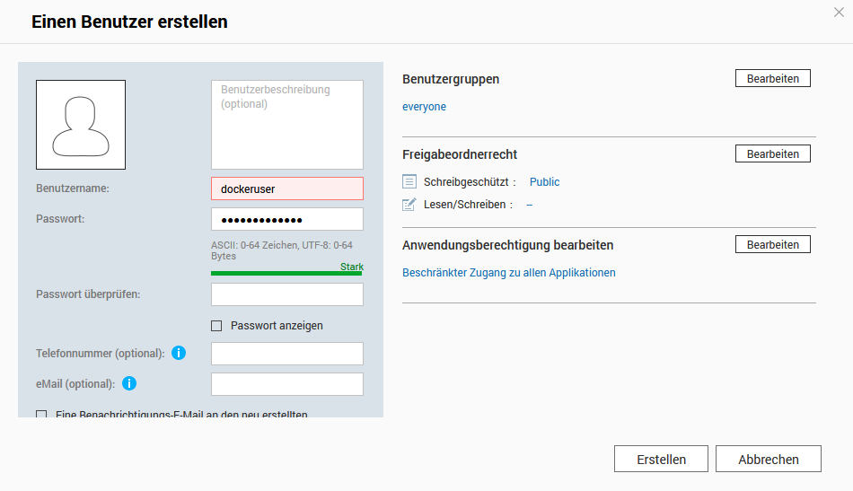

</br>

## SSL Setup
You need to aquire an SSL Certificate. You can use a free one from Let's Encrypt, but it is recommended to purchase one from myQNAPcloud or another reputable provider like GlobalSign or GoDaddy. You can get a Let's Encrypt cert right from the secuirty section in QNAP Control Panel.

Open the QNAP Control Panel and navigate to security. If you have an SSL cert then go a head and import it. If not buy one or create a free one with Let's Encrypt directly from the security section as shown below

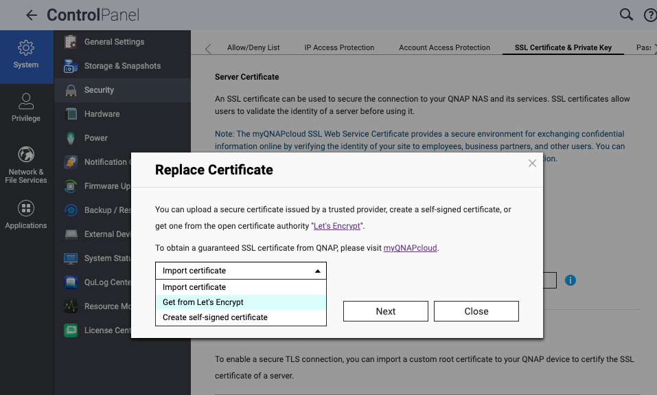

If you got one from Let's Encrypt or from MyQNAPCloud, you need to download a copy of it. Even If you purchased one outside of QNAP, you are going to need to put another copy of the cert in another folder on the QNAP. 


You are going to have to SSH into the QNAP again and creat a folder called 'ssl' like this `/share/CACHEDEV1_DATA/ssl` and move SSL cert and private key to the folder. It needs to be this path unless you want to change the path on the .yml files.


</br></br></br></br>


## Decision: do you want to use folders for the docker appdata or would you like to use volumes? 
</br></br>
## USE FOLDERS 
if you need to access or modify your data from outside the container, or use the host’s file system features, but be aware of the potential performance and security issues.

## USE VOLUMES
Choose volumes if you need to back up or migrate your data easily, share your data among multiple containers, or use volume drivers to add more functionality, but be aware of the difficulty of accessing or modifying your data from outside the container.

</br></br></br></br>

## FOR FOLDERS START HERE. 
you need to use the `docker-compose-folders.yml`. 
Skip this section if using volumes

## Folder Creation
Create a new shared folder that we will keep all docker appdata in. Load up "File Station" and create a new share by clicking on the `+` next to the Data Volume.

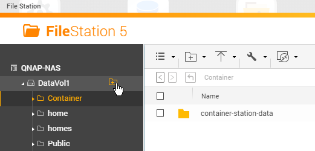

Call the folder `Docker` and give full read/write access to this folder to the newly created `dockeruser`. Everything else can be left as default.

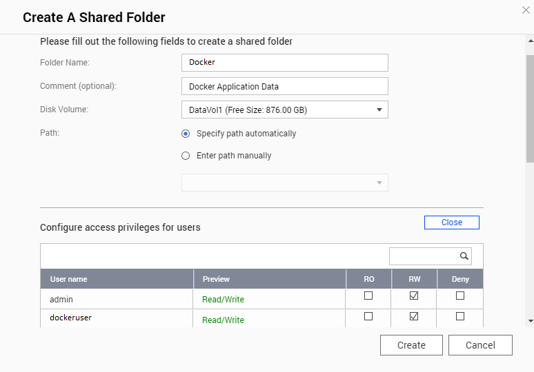

Once the `Docker` folder is created, create another folder called `nextcloud` within the `Docker` folder.

## FOR VOLUMES START HERE.
(if you are using folders, you just keep going)
you need to use the `docker-compose-volumes.yml` if you skipped the folders section. 

## Get User IDs
Now the UID/GID of the user `dockeruser` needs to be figured out. Use your favourite method to ssh into the QNAP NAS and run the following command:

```console
id <username>
```

Replace <username> with the user you created earlier (dockeruser). The result of the command should look like this:

Result:
```console
[~] # id dockeruser
uid=500(dockeruser) gid=100(everyone) groups=100(everyone)
[~] #
```

Note the UID and the GID and replace the ID's in whatever docker-compose file you are using. in the app service. see below

`services:
  app:
    image: nextcloud:latest
    container_name:
    environment:
      - PUID=1005 # <--- here
      - PGID=100 # <--- and here`


## Container Creation
Create a new application in Container Station using the docker-compose file of your choice.

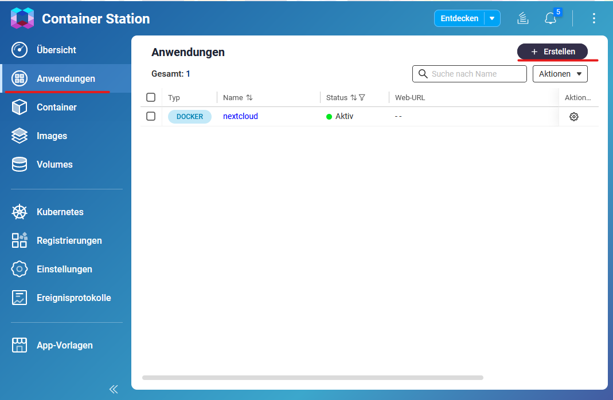

Open the `Container Station` and select `Applications` from the management menu. Click on the `Create` button.

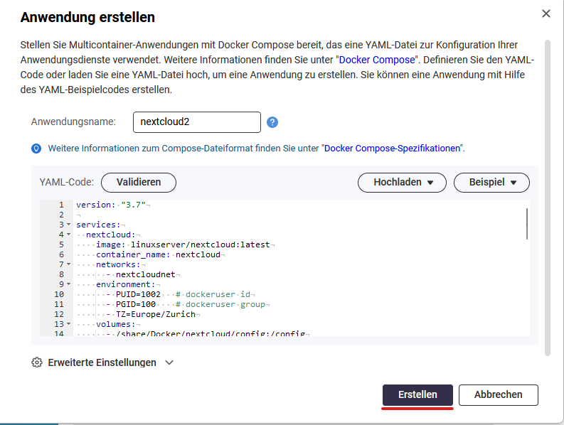

Download the docker-compose file of your choice from the repository and replace the passwords and the dockeruser id/group. the `MYSQL_PASSWORD="mysql-user-password"` is in both the app service and the db service. the  `MYSQL_ROOT_PASSWORD="mysql-root-password"` is only in the db service.

Choose a name for the Container and paste the content of the docker-compose file into the YAML section and click on the create button.


## Setup Nextcloud 
After the container is created, open the Nextcloud web interface on https://NAS-IP:4020/

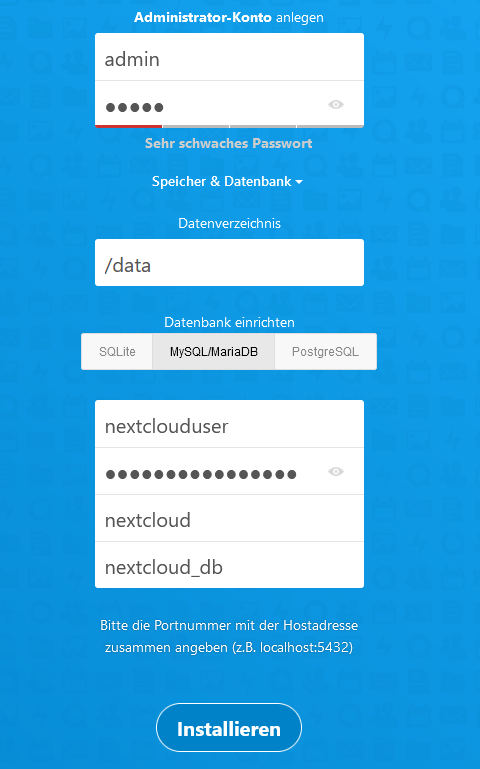

Fill in the credentials for the administrator account.

Select MySQL/MariaDB as database and use the database credentials you defined in the docker-compose file.
(MYSQL_USER, MYSQL_PASSWORD, MYSQL_DATABASE, container_name)

Click `Install` to finish the Nextcloud setup.

</br></br></br>

## UPDATING THE NEXTCLOUD APP

## Update Container
To keep everything up to date the containers need to be updated frequently.

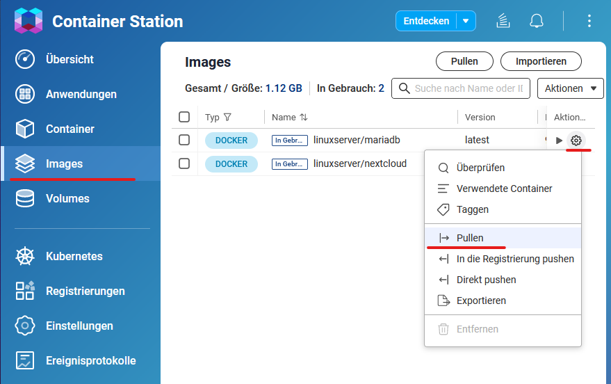

Select `Images` from the management menu and pull the latest images for mariadb and nextcloud.

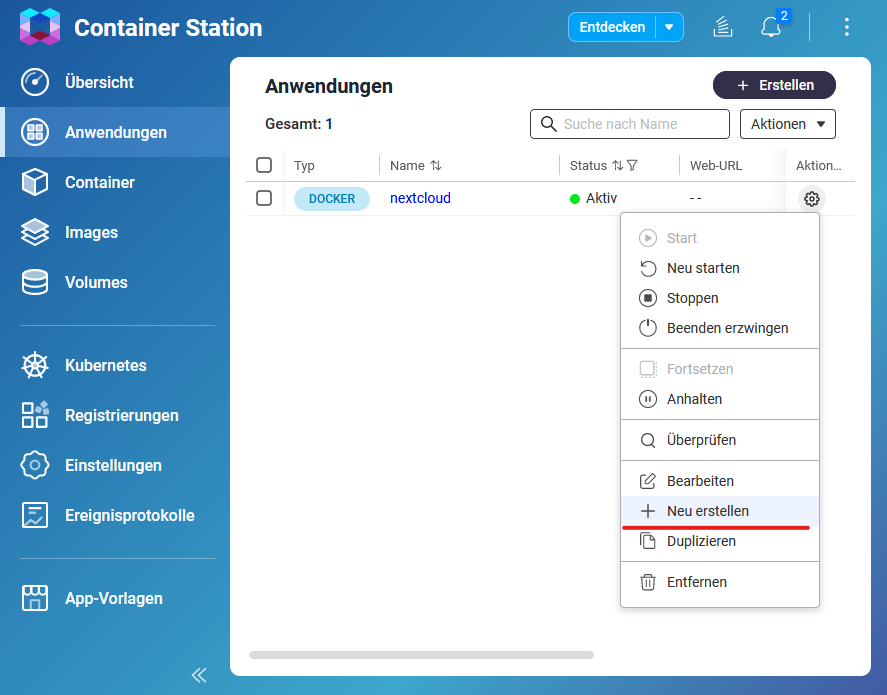

Select `Applications` from the management menu and recreate the application.

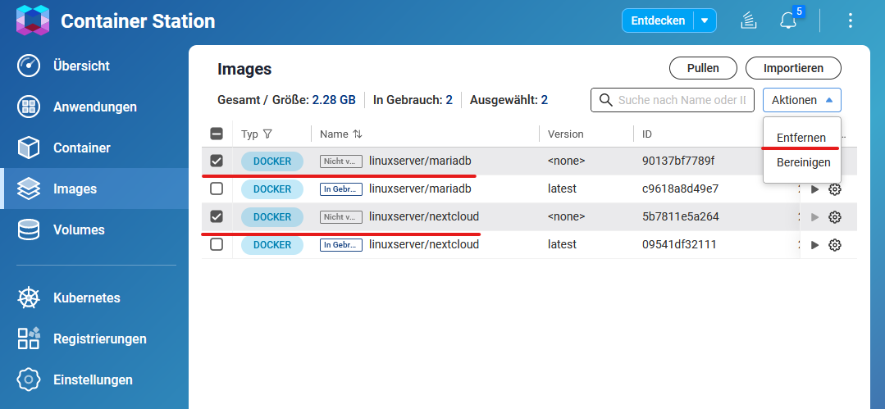

Select `Images` from the management menu and remove the **unused** images linuxserver/nextcloud and linuxserver/mariadb.


## Update Nextcloud
To update Nextcloud, it is not possible to do so directly from the web interface. Instead, the update process involves pulling the new image and recreating the container with it. When the container starts up, it automatically detects if an update is required and performs it accordingly.

It's important to note that Nextcloud can only be upgraded one major version at a time. For example, if you want to upgrade from version 26 to 28, you will first need to upgrade from version 26 to 27, and then from 27 to 28. In such cases, you will need to recreate the container with a specific version tag instead of using the latest tag. Once you have reached the latest major version, you can switch back to using the latest tag for updates.

## Nextcloud Maintenance
Occasionally, you may encounter missing database (DB) indices in your Nextcloud setup. These missing indices can be identified within the Nextcloud web interface, specifically in the administrative settings section.

To simplify the process of addressing missing DB indices, it is recommended to run the commands within Container Station. Container Station provides a convenient environment for executing commands related to a container. By utilizing Container Station, you can easily run the 'occ db:add-missing-indices' command and ensure that any missing indices are added promptly.

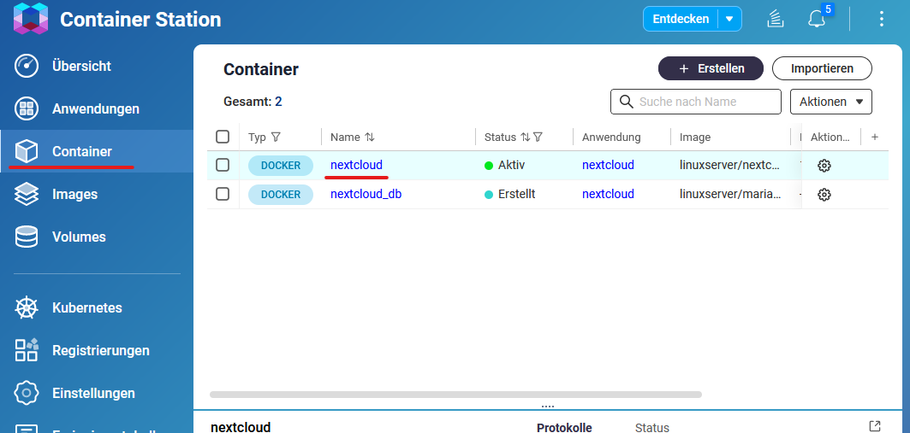

Select `Container` from the management menu and select the nextcloud container.

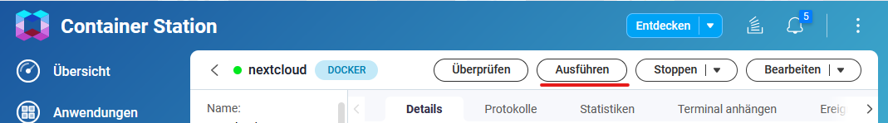

Select `Execute` from the upper menu of the nextcloud container.

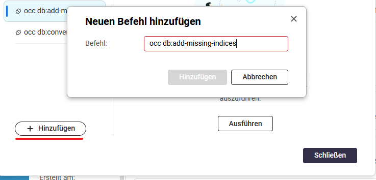

Select `Add` and insert the command you wish to execute. For example, you can use the command `occ db:add-missing-indices`. This command will ensure that any missing indices in the database are added. 
Once you have inserted the command, click on the `Save` button to save it. Now, you can execute the command. 
If you need to re-execute the command in the future, don't worry! The command is now saved and can be easily accessed. Simply navigate to the saved commands section and select the desired command. It will be executed again, allowing you to perform the necessary actions whenever required.

## Resource limits
Resource limits can be manually configured in the advanced settings. This allows you to define specific limits for CPU usage and memory allocation.

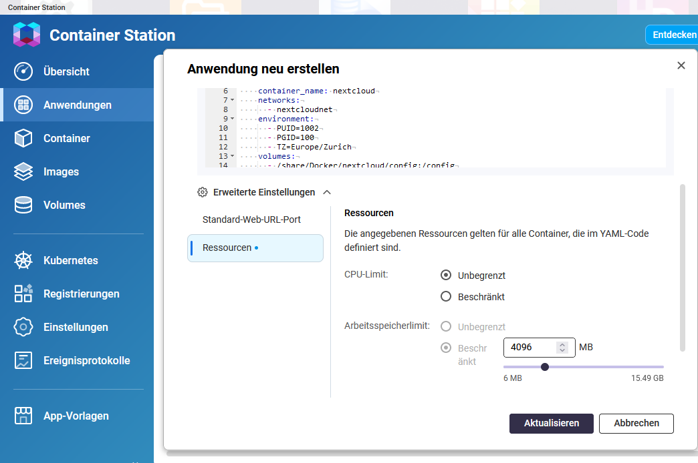

# Links
- [Access my QNAP NAS using SSH](https://www.qnap.com/en/how-to/knowledge-base/article/how-do-i-access-my-qnap-nas-using-ssh)
- [Setup QNAP user for Docker containers](https://www.linuxserver.io/blog/2017-09-17-how-to-setup-containers-on-qnap)
- [How to use Container Station](https://www.qnap.com/en/how-to/tutorial/article/how-to-use-container-station)
- [Update Nextcloud](https://docs.linuxserver.io/images/docker-nextcloud/#updating-nextcloud)
- [Blog post regarding Nextcloud updates with linuxserver/nextcloud container](https://discourse.linuxserver.io/t/upgrading-nextcloud/400)
- [Container documentation linuxserver/nextcloud](https://docs.linuxserver.io/images/docker-nextcloud)
- [Container documentation linuxserver/mariadb](https://docs.linuxserver.io/images/docker-mariadb)
