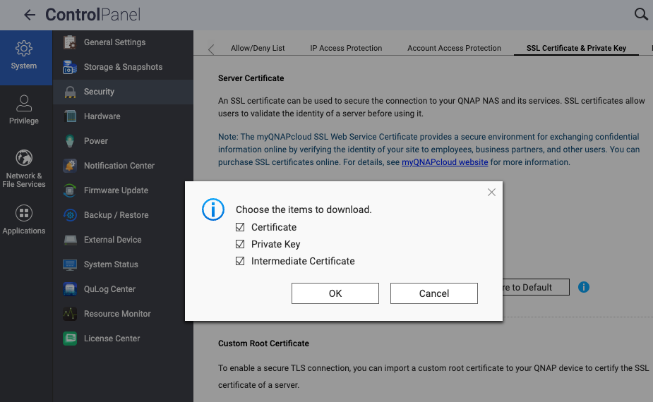

# Nextcloud on QNAP NAS using Container Station

Nextcloud is a self-hosted cloud platform that allows you to store, sync, and share your files, contacts, calendars, notes, and more. You can access your data from any device, and extend its functionality with hundreds of apps. Nextcloud is an open source alternative to popular cloud services such as Dropbox, Google Drive, and iCloud.

In this guide, you will learn how to install and configure Nextcloud on your QNAP NAS using Container Station, a QNAP app that allows you to run Docker containers and manage them with a graphical interface. You will also learn how to set up a reverse proxy, SSL, and backup for your Nextcloud instance.
</br>
## Table of Contents

- [Requirements](#requirements)
- [User Creation](#user-creation)
- [SSL Setup](#ssl-setup)
- [Reverse Proxy Setup](#reverse-proxy-setup)
- [Decision: Folders or Volumes](#decision-folders-or-volumes)
- [Folder Creation](#folder-creation)
- [Get User IDs](#get-user-ids)
- [Container Creation](#container-creation)
- [Setup Nextcloud](#setup-nextcloud)
- [Access Nextcloud](#access-nextcloud)
- [Backup and Restore](#backup-and-restore)
- [Update Container](#update-container)
- [Update Nextcloud](#update-nextcloud)
- [Nextcloud Maintenance](#nextcloud-maintenance)
- [Troubleshooting](#troubleshooting)

</br>
## Requirements

- Latest QNAP Firmware Installed.
- Container Station Installed & Updated.
- Understand how to access your QNAP via SSH.[Access my QNAP NAS using SSH](https://www.qnap.com/en/how-to/knowledge-base/article/how-do-i-access-my-qnap-nas-using-ssh)
- Two open ports on your firewall/router. One for the nextcloud container, and one for the reverse proxy
- an SSL Certificate
- A Custom Domain Name
</br>
</br>
## User Creation
Create a new user which will be used for Docker containers, so that they are not running as root (primarily for security reasons). 
Navigate to "Users" from the main screen of QTS, select "Create User," and create a user named "dockeruser."


</br>
</br>
## SSL Setup
You need to acquire an SSL Certificate. You can use a free one from Let's Encrypt, but it is recommended to purchase one from myQNAPcloud or another reputable provider like GlobalSign or GoDaddy. You can get a Let's Encrypt certificate directly from the security section in the QNAP Control Panel.

Open the QNAP Control Panel and navigate to the security section. If you already have an SSL certificate, proceed to import it. If not, consider purchasing one or creating a free one with Let's Encrypt directly from the security section as shown below.


If you obtained an SSL certificate from Let's Encrypt or MyQNAPCloud, you will need to download a copy of it. Even if you purchased one outside of QNAP, you will still need to place another copy of the certificate in a separate folder on the QNAP.



You will need to SSH into the QNAP and create a folder named 'ssl' using the following path: `/share/CACHEDEV1_DATA/ssl`. Then, move the SSL certificate and private key to this folder. It is essential to use this path unless you intend to modify the path in the .yml files.
</br>
## Reverse Proxy Setup

A reverse proxy is a type of proxy server that retrieves resources on behalf of a client from one or more servers. This can improve the security and performance of your connection to your QNAP NAS and its web services. To set up a reverse proxy for your Nextcloud container, follow these steps:

- Navigate to Control Panel > Network & File Services > Network Access. Click on the Reverse Proxy tab and then click Add to open the Add Reverse Proxy Rule window.
- Configure the Reverse Proxy Settings:
  - Protocol: Select HTTPS.
  - Domain: Use your custom domain or create one with myQNAPCloud.
  - Port number: Choose 5000 or any available port not used by other services on your QNAP NAS.
- Configure the Destination settings:
  - Protocol: Select HTTP.
  - IP address: Enter the IP address of your QNAP NAS.
  - Port number: Specify the port number of your Nextcloud container (e.g., 450).
- If necessary, configure the advanced settings. For instance, you can enable SSL offloading, allowing the reverse proxy to manage SSL encryption and decryption, thereby reducing the load on your Nextcloud container. You can also set the proxy connection timeout, define the HTTP headers to pass or remove, and customize error pages.
- Click Apply to create and enable the reverse proxy rule.
- Access your router's control panel and set up port forwarding for the specified port in the Reverse Proxy Settings (e.g., 5000). Forward this port to the IP address and port number of your QNAP NAS.
- You can now access your Nextcloud container using your myQNAPcloud DDNS domain name and the port number specified in the Reverse Proxy Settings via HTTPS (e.g., https://mynas.myqnapcloud.com:5000).

</br></br></br></br>


## Decision: Do you want to use folders for the Docker appdata or would you like to use volumes? 

</br></br>

## Use Folders 
Choose folders if you need to access or modify your data from outside the container, or utilize the host's file system features. However, be mindful of potential performance and security implications.

## Use Volumes
Opt for volumes if you require easy data backup or migration, data sharing among multiple containers, or additional functionality through volume drivers. Keep in mind the challenges associated with accessing or modifying data from outside the container.
</br></br></br></br>

## FOR FOLDERS START HERE
If you are using folders, start by using the `docker-compose-folders.yml`. Skip this section if using volumes.

## Folder Creation
Begin by creating a new shared folder to store all Docker appdata. Open "File Station" and create a new share by clicking on the `+` next to the Data Volume.


Name the folder `Docker` and grant full read/write access to the newly created `dockeruser`. Leave everything else as default.


After creating the `Docker` folder, create another folder named `nextcloud` within the `Docker` folder.

## FOR VOLUMES START HERE
(If you are using folders, continue with the next steps)
If you skipped the folders section, utilize the `docker-compose-volumes.yml`.

## Get User IDs
To determine the UID/GID of the user `dockeruser`, SSH into the QNAP NAS and execute the following command:

```console
id <username>
```

Replace `<username>` with the user you created earlier (dockeruser). The output of the command should resemble the following:

Result:
```console
[~] # id dockeruser
uid=500(dockeruser) gid=100(everyone) groups=100(everyone)
[~] #
```

Make a note of the UID and GID values and update the IDs in the appropriate `docker-compose` file under the app service as shown below:

`services:
  app:
    image: nextcloud:latest
    container_name:
    environment:
      - PUID=1005 # <--- here
      - PGID=100 # <--- and here`


## Container Creation
Begin by creating a new application in Container Station using the docker-compose file of your preference.


1. Launch `Container Station` and navigate to `Applications` in the management menu. Click on the `Create` button.


2. Download the docker-compose file from the repository and update the passwords and the dockeruser ID/group. Ensure to modify `MYSQL_PASSWORD="mysql-user-password"` in both the app service and the db service. The `MYSQL_ROOT_PASSWORD="mysql-root-password"` should only be updated in the db service.

3. Choose a name for the container, paste the contents of the docker-compose file into the YAML section, and click on the create button.

## Setup Nextcloud 
Once the container is created, access the Nextcloud web interface at https://NAS-IP:5000/


1. Enter the credentials for the administrator account.

2. Choose MySQL/MariaDB as the database and utilize the database credentials specified in the docker-compose file (MYSQL_USER, MYSQL_PASSWORD, MYSQL_DATABASE, container_name).

3. Click on `Install` to complete the Nextcloud setup.
</br></br></br>

## UPDATING THE NEXTCLOUD APP

## Update Container
To ensure everything is up to date, it is important to update the containers regularly.


1. Navigate to `Images` in the management menu and pull the latest images for mariadb and nextcloud.


2. Proceed to `Applications` in the management menu and recreate the application.


3. Access `Images` from the management menu and remove the **unused** images nextcloud and mariadb.


## Update Nextcloud
Updating Nextcloud cannot be done directly from the web interface. The update process involves pulling the new image and recreating the container with it. Upon container startup, it automatically checks for updates and applies them as needed.

It's essential to understand that Nextcloud upgrades must be done one major version at a time. For instance, upgrading from version 26 to 28 requires upgrading from 26 to 27 first, and then from 27 to 28. In such scenarios, recreate the container using a specific version tag instead of the latest tag. Once you reach the latest major version, you can revert to using the latest tag for future updates.

## Nextcloud Maintenance
At times, you may come across missing database (DB) indices in your Nextcloud configuration. These missing indices can be identified within the Nextcloud web interface, particularly in the administrative settings section.

To streamline the resolution of missing DB indices, it is advisable to execute the necessary commands within Container Station. Container Station offers a convenient platform for running commands related to a container. By leveraging Container Station, you can effortlessly execute the 'occ db:add-missing-indices' command and promptly add any missing indices.


1. Go to `Container` in the management menu and choose the nextcloud container.


2. Click on `Execute` in the upper menu of the nextcloud container.


3. Select `Add` and enter the command you want to run, such as `occ db:add-missing-indices`. This command will add any missing indices in the database. 
After entering the command, click `Save` to store it. You can now execute the command. 
If you need to rerun the command later, don't worry! The command is saved and easily accessible. Simply go to the saved commands section, choose the desired command, and execute it again as needed.

## Resource limits
Resource limits can be manually configured in the advanced settings. This allows you to define specific limits for CPU usage and memory allocation.


# Links
- [Access my QNAP NAS using SSH](https://www.qnap.com/en/how-to/knowledge-base/article/how-do-i-access-my-qnap-nas-using-ssh)
- [Setup QNAP user for Docker containers](https://www.linuxserver.io/blog/2017-09-17-how-to-setup-containers-on-qnap)
- [How to use Container Station](https://www.qnap.com/en/how-to/tutorial/article/how-to-use-container-station)
- [Update Nextcloud](https://docs.linuxserver.io/images/docker-nextcloud/#updating-nextcloud)
- [Blog post regarding Nextcloud updates with linuxserver/nextcloud container](https://discourse.linuxserver.io/t/upgrading-nextcloud/400)
- [Container documentation linuxserver/nextcloud](https://docs.linuxserver.io/images/docker-nextcloud)
- [Container documentation linuxserver/mariadb](https://docs.linuxserver.io/images/docker-mariadb)
